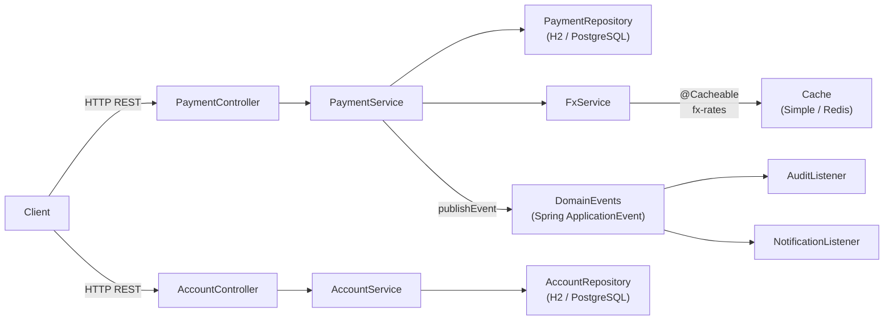

# Day 8 — Capstone Project: Mini Payment Platform

## Overview

Today you build a complete, production-grade fintech microservice from scratch.
Everything from Days 1–7 converges here: JPA entities with relationships, a full
REST API, transactional business logic, domain events, caching, retry, async
processing, custom validation, and a comprehensive test suite.

The system: a **Mini Payment Platform** that allows customers to hold accounts
in multiple currencies, transfer funds between accounts, and process payments
through an external gateway.

---

## Learning Objectives

1. Design a multi-layer Spring Boot application from scratch
2. Wire together domain model, repositories, services, and REST controllers
3. Apply `@Transactional` correctly across service boundaries
4. Publish and handle domain events with `@TransactionalEventListener`
5. Add resilience: `@Cacheable`, `@Retryable`, and `@Async`
6. Write a custom `@ValidCurrency` constraint reused across DTOs
7. Build a full test pyramid: unit → slice → integration

---

## TypeScript ↔ Java Mapping (Cumulative)

| TypeScript / Node.js                     | Java / Spring                                      |
|------------------------------------------|----------------------------------------------------|
| Express app structure                    | `@SpringBootApplication` + layered packages        |
| Prisma / TypeORM model                   | `@Entity` + `JpaRepository`                        |
| Service class with `async` methods       | `@Service` + `@Transactional`                      |
| Express `Router` + `zod` validation      | `@RestController` + `@Valid` + Bean Validation      |
| EventEmitter after DB commit             | `@TransactionalEventListener(AFTER_COMMIT)`         |
| Redis / `node-cache`                     | `@Cacheable` / `@CacheEvict`                       |
| `p-retry` wrapping HTTP call             | `@Retryable` (Spring Retry)                        |
| `BullMQ` background job                  | `@Async` + `CompletableFuture`                     |
| Jest unit tests                          | JUnit 5 + Mockito                                  |
| Supertest integration test               | `@SpringBootTest` + `TestRestTemplate`             |

---

## Project Structure

```
src/main/java/com/example/fintech/capstone/
├── CapstonApplication.java        (provided)
├── domain/
│   ├── Account.java               (TODO: JPA annotations + helpers)
│   ├── AccountStatus.java         (provided)
│   ├── Payment.java               (TODO: JPA + relationships)
│   ├── PaymentStatus.java         (provided)
│   └── DomainEvents.java          (provided)
├── repository/
│   ├── AccountRepository.java     (TODO: query methods + Spec executor)
│   ├── PaymentRepository.java     (TODO: @Query methods)
│   └── PaymentSpecs.java          (TODO: Specification factory)
├── service/
│   ├── AccountService.java        (TODO: @Transactional + events)
│   ├── PaymentService.java        (TODO: @Transactional + events)
│   ├── FxService.java             (TODO: @Cacheable + @Retryable)
│   └── ReportService.java         (TODO: @Async)
├── web/
│   ├── AccountController.java     (TODO: endpoints + @Valid)
│   ├── PaymentController.java     (TODO: endpoints + pagination)
│   ├── GlobalExceptionHandler.java (TODO: @ControllerAdvice handlers)
│   └── dto/                       (provided DTOs)
├── validation/
│   ├── ValidCurrency.java         (TODO: @Constraint)
│   └── CurrencyValidator.java     (TODO: ConstraintValidator impl)
├── async/
│   └── AsyncConfig.java           (TODO: ThreadPoolTaskExecutor)
└── exception/                     (provided exceptions)

src/test/java/com/example/fintech/capstone/
├── service/AccountServiceTest.java      (TODO: unit tests)
├── web/PaymentControllerTest.java       (TODO: @WebMvcTest tests)
└── integration/CapstoneIntegrationTest.java (TODO: end-to-end)
```

---

## Architecture Diagram



---

## Exercises

| # | File | TODOs | Concepts |
|---|------|-------|---------|
| A | `domain/Account.java` | 4 | `@Entity`, `@Table`, `@Id`, helper methods |
| B | `domain/Payment.java` | 3 | `@ManyToOne`, `@JoinColumn`, `@Enumerated` |
| C | `repository/AccountRepository.java` | 2 | `JpaSpecificationExecutor`, derived queries |
| D | `repository/PaymentRepository.java` | 2 | `@Query`, `Pageable` |
| E | `repository/PaymentSpecs.java` | 4 | `Specification<T>`, `CriteriaBuilder` |
| F | `service/AccountService.java` | 3 | `@Transactional`, event publishing |
| G | `service/PaymentService.java` | 3 | `@Transactional`, event publishing |
| H | `service/FxService.java` | 3 | `@Cacheable`, `@CacheEvict`, `@Retryable` |
| I | `service/ReportService.java` | 1 | `@Async`, `CompletableFuture` |
| J | `web/AccountController.java` | 3 | `@RestController`, `@Valid`, response codes |
| K | `web/PaymentController.java` | 3 | pagination, query params |
| L | `web/GlobalExceptionHandler.java` | 3 | `@ControllerAdvice`, `ProblemDetail` |
| M | `validation/ValidCurrency.java` | 2 | `@Constraint` |
| N | `validation/CurrencyValidator.java` | 1 | `ConstraintValidator` |
| O | `async/AsyncConfig.java` | 1 | `ThreadPoolTaskExecutor` |
| P | `service/AccountServiceTest.java` | 3 | Mockito, `@ExtendWith` |
| Q | `web/PaymentControllerTest.java` | 3 | `@WebMvcTest`, `MockMvc` |
| R | `integration/CapstoneIntegrationTest.java` | 4 | `@SpringBootTest`, `TestRestTemplate` |

---

## Key Patterns to Remember

```java
// Transactional service method that publishes an event
@Transactional
public Payment processPayment(CreatePaymentRequest req) {
    Account from = accountRepository.findById(req.fromAccountId())
        .orElseThrow(() -> new AccountNotFoundException(req.fromAccountId()));
    from.debit(req.amount()); // throws InsufficientFundsException if balance < amount

    Payment payment = new Payment(from, req.amount(), req.currency());
    paymentRepository.save(payment);

    // Event fires AFTER this transaction commits
    eventPublisher.publishEvent(new DomainEvents.PaymentCreated(payment.getId()));
    return payment;
}

// Dynamic query combining Specifications
public List<Payment> search(String accountId, PaymentStatus status, BigDecimal minAmount) {
    return paymentRepository.findAll(
        Specification.where(PaymentSpecs.forAccount(accountId))
            .and(PaymentSpecs.withStatus(status))
            .and(PaymentSpecs.amountAtLeast(minAmount))
    );
}
```
